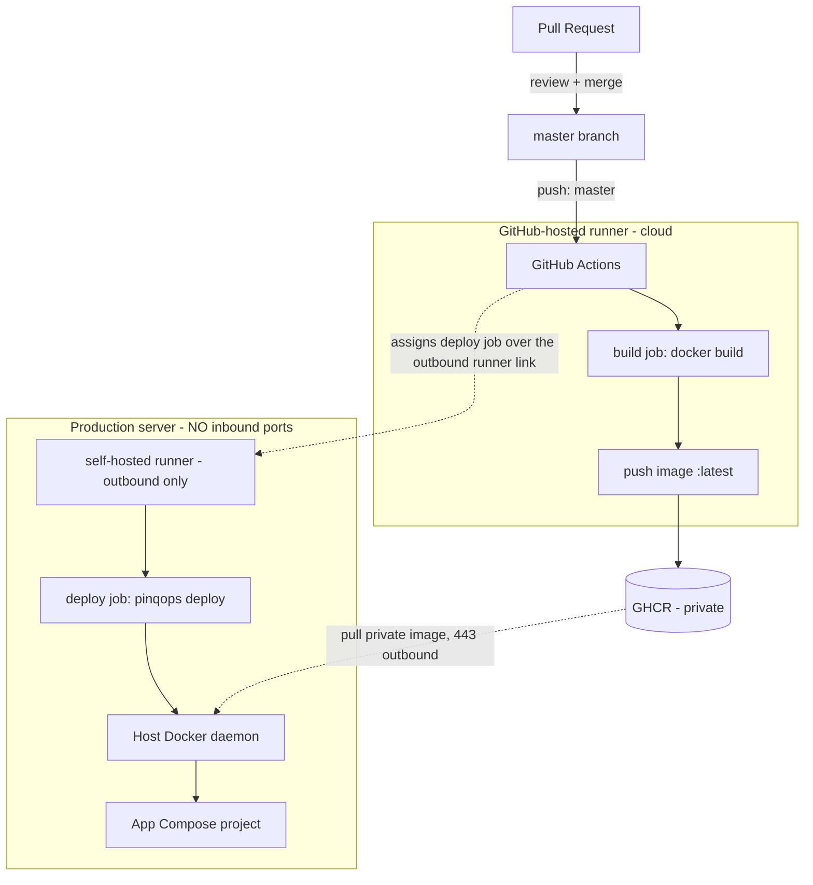

# pinqops

**A minimal, open-source DevOps CLI + pipeline for auto-deploying Docker apps to a fully closed server. Merge to `master` → GitHub builds and pushes the image → a self-hosted runner on your server runs the `pinqops` CLI to pull it and update one fixed Docker Compose project. The server exposes NO inbound ports — no 443, no SSH, no Docker daemon. The runner only dials out.**


> Vercel-style: the moment the GitHub Action finishes, your server is live — but it's *your* closed box, not a hosted platform. The trick is a small agent on the server that holds an **outbound** connection to GitHub, so nothing has to be opened inbound.

> **pinqops is the seed of a DevOps toolkit.** Today it does one thing well — closed-server Docker deploys — but it is a plain .NET CLI designed to grow: more commands (health checks, rollout controls, environment inspection) can be added to the same `pinqops` binary over time.

---

## Table of contents

- [Why](#why)
- [Architecture](#architecture)
- [How it works](#how-it-works)
- [Security model](#security-model)
- [Prerequisites](#prerequisites)
- [Quick start](#quick-start)
- [The pinqops CLI](#the-pinqops-cli)
- [Configuration](#configuration)
- [Repository layout](#repository-layout)
- [Non-goals (out of scope)](#non-goals-out-of-scope)
- [Troubleshooting](#troubleshooting)
- [FAQ](#faq)
- [Contributing](#contributing)
- [License](#license)

## Why

Most "auto-deploy" setups make you open an inbound port — an SSH port, a webhook
endpoint, or the Docker daemon over TCP. pinqops is for the case where the
production server must stay **completely closed**: nothing listens for the
internet, and the box only ever makes **outbound** connections.

- **Zero inbound ports.** No 443, no SSH (22), no Docker TCP socket.
- **Deploy only on `master` merge.** Opening a pull request, or pushing to any
  other branch, must **not** deploy.
- **Instant, not polling.** The deploy happens the moment CI finishes — no
  waiting for a poll interval.
- **No secrets stored on the server.** Registry auth uses the per-job,
  short-lived `GITHUB_TOKEN`.
- **One small .NET binary.** The deploy engine and the runner installer are the
  same self-contained `pinqops` CLI — easy for a .NET team to read and extend.

This is achieved with a **GitHub Actions self-hosted runner** installed on the
server. The runner dials GitHub outbound; when the `master` workflow runs,
GitHub hands the deploy job down that connection and the `pinqops` CLI executes
it locally. Same feel as Vercel, on your own closed machine.

The application being deployed is treated as an opaque package — pinqops only
pulls the new image and restarts one predefined Compose project. What the app
does or how it serves traffic is out of scope.

## Architecture



| Component | Where | Responsibility |
|---|---|---|
| `build` job | GitHub-hosted runner (cloud) | Build the image, push `:latest` to GHCR |
| Self-hosted runner | Production server (systemd service) | Receives the deploy job over its outbound link |
| `pinqops` CLI | Runs on the self-hosted runner | `docker compose pull && up -d` against the fixed project |
| App Compose project | Production server | The single, fixed project that is pulled + restarted |

## How it works

1. A reviewed pull request is **merged into `master`** (branch protection makes
   merge the only path — direct pushes are blocked).
2. The `build` job runs on a **GitHub-hosted** runner: it builds the application
   image and pushes it to GHCR as `ghcr.io/<owner>/<repo>:latest`. The
   production server is not involved and never receives the source.
3. The `deploy` job is assigned to the **self-hosted runner** on your server,
   over the outbound connection the runner already holds open. No inbound port
   is used.
4. On the server, the deploy job authenticates to GHCR with the per-job
   `GITHUB_TOKEN` and runs `pinqops deploy`, which executes a **fixed** command
   against a **fixed** compose file:
   ```
   docker compose -f /opt/pinqops/docker-compose.yml pull
   docker compose -f /opt/pinqops/docker-compose.yml up -d
   ```
5. The host Docker daemon pulls the new private image (outbound 443) and
   recreates the container. Deploy is effectively instant.

See [`docs/ARCHITECTURE.md`](docs/ARCHITECTURE.md) for the detailed flow and
trust boundaries.

## Security model

- **No inbound attack surface.** The server listens for nothing; the runner only
  makes outbound HTTPS to GitHub and GHCR.
- **Branch enforcement.** The workflow triggers only on `push` to `master`, and
  the `deploy` job runs only after a successful `build`. Pull requests never run
  on the self-hosted runner.
- **No stored secrets on the server.** The runner registration token is
  short-lived; registry auth uses the ephemeral `GITHUB_TOKEN` per job.
- **Fixed command, no injection.** The compose path and arguments are built as
  discrete list items (never a shell string), and no repository content is
  checked out or executed on the server during deploy.
- **Least privilege.** The `build` job gets `packages: write`; the `deploy` job
  gets only `packages: read`.

The runner runs as a user in the `docker` group, which is **root-equivalent** on
the host. Keep the repository private and review the trade-offs in
[`SECURITY.md`](SECURITY.md).

## Prerequisites

- A GitHub repository whose protected branch is `master` (private recommended).
- A production server with:
  - Docker Engine + the Docker Compose plugin.
  - A user in the `docker` group to run the runner service.
  - Outbound HTTPS (443) to `github.com` and `ghcr.io`. **No inbound ports
    required.**
- Ability to install a systemd service and enable branch protection.
- **For development of pinqops itself:** the .NET 10 SDK.

## Quick start

### 1. GitHub side

1. **Enable branch protection** on `master`: require pull requests and block
   direct pushes. See [`docs/SETUP.md`](docs/SETUP.md#1-branch-protection).
2. **Add your application `Dockerfile`** at the repository root (see
   [`examples/app/Dockerfile.example`](examples/app/Dockerfile.example)).
3. No repository secrets are required for build/deploy — `GITHUB_TOKEN` is
   provided automatically.

### 2. Server side

```bash
# Install the pinqops CLI (self-contained binary from the latest release).
sudo curl -fsSL -o /usr/local/bin/pinqops \
  https://github.com/pinqponq/pinqops/releases/latest/download/pinqops
sudo chmod +x /usr/local/bin/pinqops

# Install the self-hosted runner as a systemd service.
# Get the registration token from: repo → Settings → Actions → Runners → New self-hosted runner
sudo mkdir -p /opt/actions-runner && sudo chown "$USER" /opt/actions-runner
pinqops install-runner \
  --repo-url https://github.com/<owner>/<repo> \
  --token <registration-token> \
  --user "$USER"

# Put the fixed application Compose project where the deploy job expects it.
sudo mkdir -p /opt/pinqops
sudo cp deploy/app.docker-compose.example.yml /opt/pinqops/docker-compose.yml
# Edit it: set image: ghcr.io/<owner>/<repo>:latest
```

### 3. Try it

Merge a PR into `master`, watch the Actions run (`build` → `deploy`), and check
the runner service:

```bash
sudo /opt/actions-runner/svc.sh status
```

The full walkthrough is in [`docs/SETUP.md`](docs/SETUP.md).

## The pinqops CLI

```
pinqops deploy [--compose-file <path>] [--no-prune] [--timeout-seconds <n>]
    Pull the new image and restart the fixed compose project.
    Defaults: --compose-file from $APP_COMPOSE_PATH or /opt/pinqops/docker-compose.yml

pinqops install-runner --repo-url <url> --token <token>
                       [--labels <labels>] [--name <name>]
                       [--version <runner-version>] [--dir <path>] [--user <user>]
    Install and register a GitHub Actions self-hosted runner as a systemd
    service (outbound-only; no inbound port on the server).

pinqops version
pinqops help
```

## Configuration

There is almost nothing to configure — that's the point.

| Setting | Where | Default |
|---|---|---|
| Runner label | `runs-on` in `examples/workflows/deploy.yml` / `--labels` at install | `pinqops-prod` |
| App compose path | repo variable `APP_COMPOSE_PATH` (optional) | `/opt/pinqops/docker-compose.yml` |
| Image reference | your app compose file | `ghcr.io/<owner>/<repo>:latest` |

Full reference: [`docs/CONFIGURATION.md`](docs/CONFIGURATION.md).

## Repository layout

```
.
├── src/
│   ├── PinqOps.Core/          # Deploy engine + runner installer (library)
│   └── PinqOps.Cli/           # The `pinqops` console app (deploy, install-runner)
├── tests/
│   └── PinqOps.Core.Tests/    # xUnit tests
├── .github/workflows/
│   ├── ci.yml                 # PR validation: dotnet build + test
│   └── release.yml            # tag → publish self-contained pinqops binary
├── deploy/
│   └── app.docker-compose.example.yml   # The single, fixed app project (example)
├── examples/
│   ├── app/Dockerfile.example
│   └── workflows/deploy.yml   # TEMPLATE: copy into your app repo's .github/workflows/
├── docs/                      # ARCHITECTURE, SETUP, CONFIGURATION, DEVELOPING-WITH-CLAUDE
├── .pinq-doq/                 # Submodule: shared Claude standards (vendored)
└── pinqops.sln
```

Clone with `--recurse-submodules` to pull the shared standards under `.pinq-doq`.
(`.claude/` is generated locally from pinq-doq and is git-ignored — see
[`docs/DEVELOPING-WITH-CLAUDE.md`](docs/DEVELOPING-WITH-CLAUDE.md).)

## Non-goals (out of scope)

By deliberate design, pinqops does **not** (yet) include:

- Kubernetes or Docker Swarm
- A web dashboard / UI
- Multiple servers, environments, or regions
- Rollbacks or image version history (a moving `:latest` tag is used)
- Advanced monitoring, alerting, or metrics
- Managing the application's own ports, TLS, or networking

The CLI is designed to grow toward a broader DevOps toolkit, but the core deploy
path stays deliberately minimal.

## Troubleshooting

| Symptom | Likely cause | Fix |
|---|---|---|
| `deploy` job stuck "Waiting for a runner" | Runner offline or label mismatch | Check `svc.sh status`; ensure the runner label matches `runs-on` |
| `pinqops: command not found` on the runner | Binary not on PATH | Install to `/usr/local/bin/pinqops` (see Quick start) |
| Pull fails / old image keeps running | GHCR permission | Ensure the package is linked to the repo so `GITHUB_TOKEN` (`packages: read`) can pull |
| `permission denied` on docker | Runner user not in `docker` group | `sudo usermod -aG docker <user>` and restart the runner service |
| Deploy runs on a non-master push | — | It can't: the workflow triggers only on `push` to `master` |

More in [`docs/SETUP.md`](docs/SETUP.md#troubleshooting).

## FAQ

**Does the server open any inbound port?** No. The runner only makes outbound
connections to GitHub and GHCR.

**Why a self-hosted runner instead of a webhook?** A webhook would require an
inbound endpoint on the server. A runner keeps the server fully closed while
still deploying the instant CI finishes.

**Why .NET?** The team is a .NET shop, and pinqops is meant to grow into a
broader DevOps toolkit — a single, testable .NET CLI is a comfortable foundation
to extend.

**Why a moving `:latest` tag?** Simplicity; rollbacks are out of scope. Because
only the `master` workflow pushes `:latest`, "deploy on master merge" is
preserved.

**Is the source code copied to the server?** No. The `deploy` job does not check
out the repository; it only runs `pinqops deploy`, which pulls the pre-built
image.

## Contributing

Contributions are welcome!

- **Report a bug or request a feature:** open an issue (Issues → New issue) and
  pick a template.
- **Send a change:** see [`CONTRIBUTING.md`](CONTRIBUTING.md) for the dev setup
  (`.NET 10 SDK`, `git clone --recurse-submodules`), tests, and PR flow.
- **Develop with Claude:** this repo uses Claude Code with the shared pinq-doq
  standards — see [`docs/DEVELOPING-WITH-CLAUDE.md`](docs/DEVELOPING-WITH-CLAUDE.md).
- Please follow the [`CODE_OF_CONDUCT.md`](CODE_OF_CONDUCT.md), and report
  security issues privately per [`SECURITY.md`](SECURITY.md).

## License

[MIT](LICENSE) © pinqops contributors
